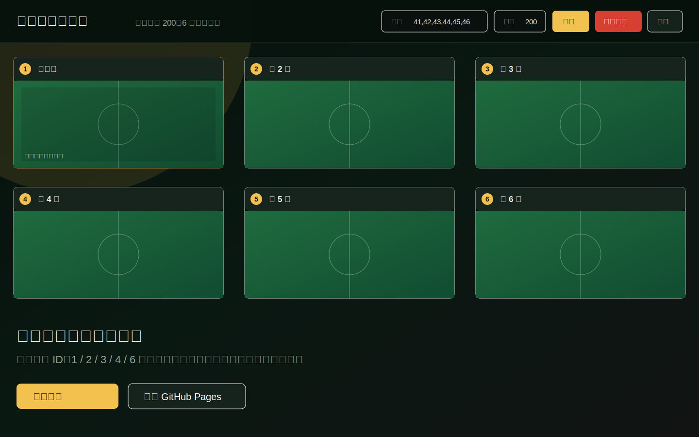

# 苏超多路直播墙

一个专门给苏超多场比赛同时观看用的直播墙。打开网页就能看，不用安装 App，不用登录后台，适合电脑大屏、办公室电视、投屏和手机临时查看。

[立即打开苏超多路直播墙](https://jamesju1987.github.io/suchao/)


## 核心卖点

- **一页多场**：支持 `1 / 2 / 3 / 4 / 6` 场比赛同时展示。
- **打开即用**：默认尝试自动检查当天赛程；检测不到时默认展示 3 场。
- **画面优先**：每个直播区域优先保持 `16:9`，尽量只展示直播画面。
- **大屏友好**：电脑大屏下顶部控制条会自动隐藏，鼠标移动到页面顶部再显示。
- **手机可用**：手机端自动变成单列滚动，每场直播全宽显示，不会挤成小块。
- **主画面模式**：`1 / 2 / 3` 场支持主画面；`4 / 6` 场自动隐藏主画面入口，保持多场均分。
- **视频源可换**：默认使用荔枝新闻官方赛事页，也可以改成其他支持 `{turnId}` 和 `{scheduleId}` 的视频源模板。

## 页面截图



## 扫码使用


## 快速使用

直接访问：

```text
https://jamesju1987.github.io/suchao/
```

常用参数示例：

```text
https://jamesju1987.github.io/suchao/?turnId=200&scheduleId=41&count=1
https://jamesju1987.github.io/suchao/?turnId=200&scheduleId=41&count=2
https://jamesju1987.github.io/suchao/?turnId=200&scheduleId=41&count=3
https://jamesju1987.github.io/suchao/?turnId=200&scheduleId=41&count=4
https://jamesju1987.github.io/suchao/?turnId=200&scheduleId=41&count=6
```

如果想指定具体场次，可以用 `ids`：

```text
https://jamesju1987.github.io/suchao/?turnId=200&ids=41,42,43,44,45,46
```

## 布局规则

| 场次数 | 电脑大屏 | 手机 |
| --- | --- | --- |
| 1 场 | 单画面最大化 | 单列全宽 |
| 2 场 | 左右双画面 | 单列全宽 |
| 3 场 | 一行三画面 | 单列全宽 |
| 4 场 | 2x2，不显示主画面 | 单列全宽 |
| 6 场 | 3x2，不显示主画面 | 单列全宽 |

如果误填 5 个场次，页面会自动补到 6 个，避免电视墙布局不均衡。

## 操作说明

- **场数**：选择要看的比赛数量，支持 `1 / 2 / 3 / 4 / 6`。
- **应用**：按当前场数重新生成直播墙。
- **自动网格**：按当前场数自动排布，是推荐模式。
- **主画面**：只在 `1 / 2 / 3` 场时显示。
- **纵向**：电脑上也可以强制纵向排列。
- **每场输入框**：可以单独改某一路的 `scheduleId`，按回车生效。
- **刷新按钮**：只刷新当前这一路。
- **区域内全屏按钮**：只放大当前区域内的直播画面，不会跳成整个浏览器全屏。

## 参数说明

- `turnId`：轮次 ID，默认 `200`
- `scheduleId`：起始比赛场次 ID，默认 `41`
- `count`：比赛场数，支持 `1 / 2 / 3 / 4 / 6`
- `ids`：指定比赛场次 ID，用英文逗号分隔；提供后优先使用它
- `layout`：布局模式，可选 `equal`、`focus`、`stack`
- `focus`：主画面索引，从 `0` 开始
- `source`：视频源模板，支持 `{turnId}` 和 `{scheduleId}` 占位符
- `cropTop`：高级参数，用于手动裁掉视频源顶部区域，默认 `0`

## 数据统计

页面已接入 Google Analytics 4：

```text
G-NZ6N8W92YL
```

当前会记录页面打开、布局切换、应用场数、切换区域内全屏、刷新单路直播、iframe 加载等事件，方便后续看有多少人使用、怎么使用。

## 部署

项目是纯静态网页，仓库根目录直接发布到 GitHub Pages 即可。

线上地址：

```text
https://jamesju1987.github.io/suchao/
```
